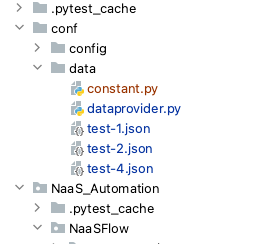
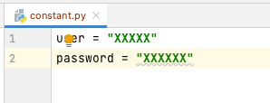

# NaaS automation test framework based on Pytest. 
## Refer below for quick setup.

 [PyTest](https://docs.pytest.org/en/latest/getting-started.html ) 
 
- **Python Version : 3.9** 
- Steps to install:
 - Install Pycharm CE and set the interpretor version to Python 3.7 and run the following command from the Pycharm terminal
 - pip install -r requirements.txt 
 - Note: if install fails, disconnect from VPN and repeat above steps.
 - Create a `constant.py` file under conf >> data folder 
  
 -  Add user credentials to the constant.py file.
 `user = "add your autopilot login  username"
 password = "add your autopilot login password"`
 
- Command to run tests from local on any environment based on RUN_ENV variable
 - RUN_ENV="test-4" pytest  --alluredir ./Reports -v -s NaaS_Automation/NaaSFlow/DIA/test/test_DIA_Automation.py (To Include Reports)
 - RUN_ENV="test-4" pytest  -v -s NaaS_Automation/NaaSFlow/DIA/test/test_DIA_Automation.py (Without Reports)
 - RUN_ENV=<test_environment> pytest NaaS_Automation/NaaSFlow/<path_to_the_test_directory>/<test_platform>/<test_file_name> (to run a single test file)
 - Additonal Commands
 - pytest --fixtures (to show list of fixtures available)
 - For Pycharm support : Preferences -> Tools -> Python Integrated Tools : Change default testrunner to pytest
 - For choosing environment from command line -> **RUN_ENV='prod' pytest list_of_args** . This will override the RUN_ENV in pytest.ini

- All the pytest related configuration should go in to pytest.ini
 `pytest` implements the following standard test discovery:

- If no arguments are specified then collection starts from [`testpaths`](http://doc.pytest.org/en/latest/reference.html#confval-testpaths) (if configured) or the current directory. Alternatively, command line arguments can be used in any combination of directories, file names or node ids..
- Recurse into directories, unless they match [`norecursedirs`](http://doc.pytest.org/en/latest/reference.html#confval-norecursedirs).
- In those directories, search for `test_*.py` or `*_test.py` files, imported by their [test package name](http://doc.pytest.org/en/latest/goodpractices.html#test-package-name).
- From those files, collect test items:
 - `test` prefixed test functions or methods outside of class
 - `test` prefixed test functions or methods inside `Test` prefixed test classes (without an `__init__` method)
 